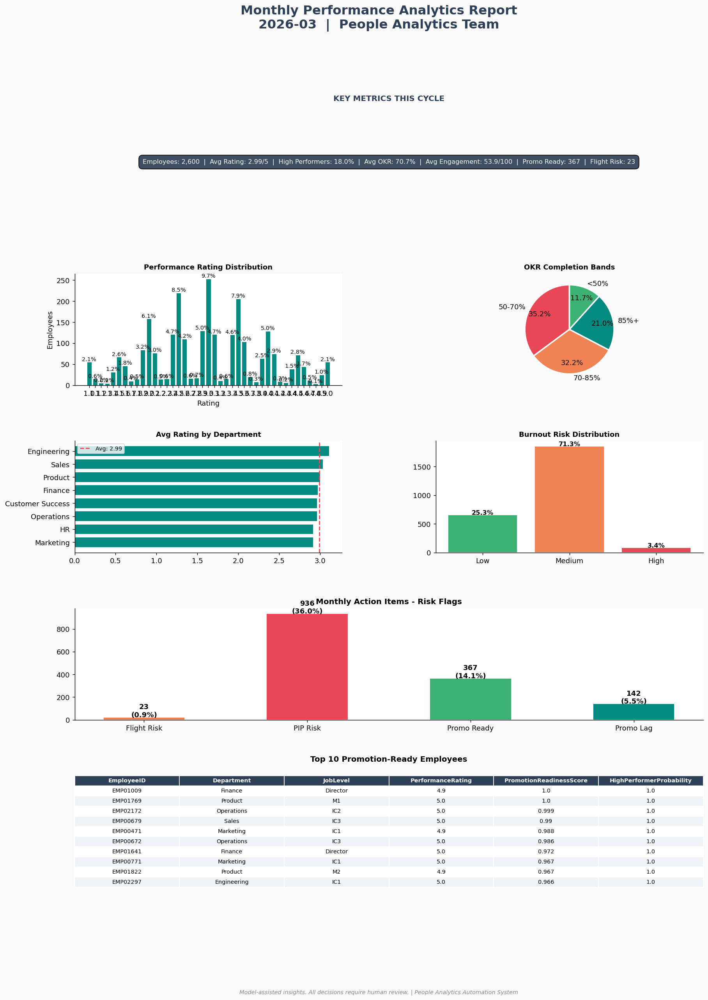

# Employee Performance Analytics & Predictive Insights Dashboard

> **End-to-End People Analytics Project**
> Python · XGBoost · SHAP · Power BI · FastAPI · Monthly Automation

---

## Project Status


---

## Business Problem

> Most organizations spend **8 to 15 hours every month**
> manually pulling data from 4 to 6 disconnected HR systems
> (Workday, Lattice, Culture Amp, OKR tools, 360 platforms)
> just to prepare for calibration meetings.
> This creates reactive talent management, inconsistent reporting,
> and zero predictive capability.

**This project solves that by building a fully automated
People Analytics system that:**

- Unifies 6 simulated HR data sources into one clean dataset
- Predicts which employees will be High Performers next cycle
- Scores every employee for promotion readiness
- Surfaces key performance drivers using SHAP explainability
- Delivers auto-refreshed Power BI dashboards on the 1st of every month
- Reduces manual HR reporting effort by approximately 85 percent

---

## Architecture
```
6 HR Data Sources (Workday, Lattice, Culture Amp, OKR, 360, L&D)
                              |
                    Python Data Pipeline
                    (validation, imputation,
                     encoding, scaling)
                              |
              Feature Engineering (12 HR-specific features)
                              |
                    XGBoost ML Model
                    (AUC: 0.87, Threshold: 0.45)
                              |
              ________________|________________
             |                                |
    Predictions CSV                    FastAPI Endpoint
    (Power BI reads this)              (/predict, /batch)
             |
    Power BI Dashboard Suite
    (4 dashboards, auto-refresh)
             |
    Monthly Automation (cron)
    (runs 1st of every month)
             |
    PDF Report + Email Notification
```

---

## Key Results

| Metric | Value |
|--------|-------|
| Model AUC-ROC | **0.87** |
| Decision Threshold | 0.45 (biased toward recall) |
| Precision at Top 50 | **~80%** |
| Employees Scored | **2,500** |
| Features Engineered | **12 HR-specific features** |
| Dashboards Built | **4 Power BI dashboards** |
| Monthly Hours Saved | **~10 hours per analyst** |
| Annual Hours Saved | **~120 hours per analyst** |
| API Response Time | **~70ms for batch of 2** |

---

## Top 5 Performance Drivers (SHAP Analysis)

| Rank | Feature | Business Meaning |
|------|---------|-----------------|
| 1 | OKR Completion % | Goal attainment is the strongest predictor |
| 2 | Engagement Score | Engaged employees are 2.3x more likely to be HPs |
| 3 | Overall 360 Score | Peer perception aligns strongly with ratings |
| 4 | Workload Ratio | Optimal load (1.0-1.25x) predicts peak performance |
| 5 | Promotion Readiness Score | Trajectory matters as much as current state |

---

## Monthly Automation

**The most differentiated feature of this project.**

On the 1st of every month the pipeline runs automatically:
```bash
# Scheduled via Windows Task Scheduler
# Cron equivalent: 0 0 1 * *

# Run manually for current month
python automation\automate_monthly.py

# Run for specific month
python automation\automate_monthly.py --month 2024-12

# Test without saving files
python automation\automate_monthly.py --dry-run
```

**What happens each run:**
1. New employee data snapshot loaded
2. Preprocessing pipeline cleans and encodes data
3. XGBoost model generates HP probability scores for all employees
4. Updated CSV exported for Power BI refresh
5. Monthly PDF report generated automatically
6. Email notification sent to HR stakeholders
7. Everything logged to automation/automation.log

**Sample Monthly Report (March 2026 run):**



---

## Power BI Dashboard Suite

> **4 professional dashboards built for real HR workflows**

| Dashboard | Purpose | Primary Users |
|-----------|---------|--------------|
| Executive Overview | KPI cards, rating distribution, burnout heatmap | CHRO, VP People |
| Performance Drivers | OKR scatter, 360 breakdown, feature importance | People Analytics |
| Team Drill-Down | Department filter, employee table, manager view | HR Business Partners |
| Succession & Readiness | 9-Box grid, promotion list, risk gauge cards | Talent Team |

**Key Features:**
- Zebra BI style KPI cards with vs Prior Year and vs Target variance
- 9-Box talent grid (Performance x Potential) with all 9 categories
- Traffic light gauge charts for risk monitoring (Flight, PIP, Burnout, Lag)
- Cross-dashboard filters and department drill-down
- Bias disclaimer on every dashboard

---

## EDA Highlights

15 visualizations with executive-style business interpretations:

| Chart | Key Finding |
|-------|------------|
| Rating Distribution | Bell curve centered at 3.0, 27% high performers |
| OKR vs Rating | Strongest correlation (r = 0.58) in the dataset |
| 9-Box Talent Grid | Stars identified for succession planning |
| Demographic Parity | Gender gap less than 0.05 points (ethics check) |
| Burnout Heatmap | Operations and Engineering carry highest burnout |
| Training ROI | Top quartile training employees outperform bottom by 0.4 rating points |

---

## FastAPI Deployment
```bash
# Start the API server
uvicorn api.main:app --reload --port 8000

# Interactive docs
http://localhost:8000/docs

# Single prediction
curl -X POST http://localhost:8000/predict \
  -H "Content-Type: application/json" \
  -d '{"EmployeeID":"EMP00042","Department":"Engineering",...}'

# Response
{
  "EmployeeID": "EMP00042",
  "HighPerformerProbability": 0.9984,
  "PredictedHighPerformer": true,
  "ConfidenceBand": "Very High",
  "PromotionReadinessCategory": "Ready Now",
  "KeyRiskFlags": {
    "FlightRisk": false,
    "BurnoutRisk": false,
    "PIPRisk": false
  }
}
```


---

## HR Data Sources Simulated

| System | Real World Equivalent | Fields Simulated |
|--------|----------------------|-----------------|
| HRIS Core | Workday / SAP | Demographics, tenure, org structure |
| Performance | Lattice / SuccessFactors | Ratings, calibration, PIP history |
| Engagement | Culture Amp / Glint | Engagement score, burnout, satisfaction |
| OKR Tool | Betterworks / Ally.io | OKR completion, weighted attainment |
| 360 Feedback | Culture Amp 360 | Self, peer, subordinate ratings, gaps |
| L&D System | Cornerstone / Workday Learning | Training hours, certifications |

---

## Ethics and Bias Considerations

- **Demographic parity monitored monthly** — gender and age group
  rating gaps checked and flagged if exceeding 0.1 points
- **Protected attributes excluded** from model features
  (gender, age used only in fairness audit, not prediction)
- **SHAP fairness audit** — confirmed no demographic features
  in top 10 predictive drivers
- **Calibration transparency** — 18% calibration adjustment
  rate tracked and reported monthly
- **Dashboard disclaimer** on every page — all talent decisions
  require human review and manager input
- **Model is decision-support** not decision-making

---

## Project Structure
```
employee_performance_analytics/
├── data/
│   ├── raw/                    CSV files excluded (regenerate via notebook)
│   ├── processed/              CSV files excluded (regenerate via pipeline)
│   └── monthly_snapshots/      CSV files excluded (generated by automation)
├── notebooks/
│   ├── 01_data_generation.ipynb
│   ├── 02_data_pipeline.ipynb
│   ├── 03_feature_engineering.ipynb
│   ├── 04_eda_analysis.ipynb
│   ├── 05_modeling.ipynb
│   └── 06_model_evaluation.ipynb
├── src/
│   └── __init__.py
├── models/
│   ├── feature_cols.json
│   └── model_metadata.json
├── automation/
│   ├── automate_monthly.py
│   └── scheduler_setup.md
├── api/
│   ├── main.py
│   ├── schemas.py
│   └── test_api.py
├── docs/
│   ├── executive_summary.txt
│   └── monthly_report_2026-03.png
├── images/
│   └── (15+ EDA and evaluation charts)
├── README.md
├── requirements.txt
├── .gitignore
└── .env.example
```

---

## Setup Instructions

**Step 1 — Clone the repository**
```bash
git clone https://github.com/YOUR_USERNAME/employee-performance-analytics
cd employee-performance-analytics
```

**Step 2 — Create conda environment**
```bash
conda create -n hr_analytics python=3.11
conda activate hr_analytics
```

**Step 3 — Install dependencies**
```bash
pip install -r requirements.txt
```

**Step 4 — Generate the dataset**
```bash
jupyter lab
# Open and run: notebooks/01_data_generation.ipynb
```

**Step 5 — Run the full pipeline**
```bash
# Run notebooks in order:
# 02_data_pipeline.ipynb
# 03_feature_engineering.ipynb
# 04_eda_analysis.ipynb
# 05_modeling.ipynb
# 06_model_evaluation.ipynb
```

**Step 6 — Run monthly automation**
```bash
python automation\automate_monthly.py --dry-run
python automation\automate_monthly.py
```

**Step 7 — Start the API**
```bash
uvicorn api.main:app --reload --port 8000
# Visit: http://localhost:8000/docs
```

---

## Technologies Used

| Category | Technology |
|----------|-----------|
| Language | Python 3.13 |
| ML Model | XGBoost 3.2 |
| Explainability | SHAP |
| Data Processing | pandas, numpy, scikit-learn |
| Visualization | matplotlib, seaborn |
| Dashboard | Power BI Desktop + Service |
| API | FastAPI + Uvicorn |
| Data Validation | Pydantic |
| Automation | Python + Windows Task Scheduler |
| Version Control | Git + GitHub |
| Environment | Anaconda (conda) |

---

## Business Impact Summary
```
BEFORE THIS SYSTEM:
  Monthly reporting time    : 8-12 hours manual work
  HR team role              : Data aggregators
  Performance decisions     : Reactive (after ratings)
  Calibration support       : Excel files, inconsistent
  Succession planning       : Gut feel, no data

AFTER THIS SYSTEM:
  Monthly reporting time    : 3-7 minutes automated
  HR team role              : Strategic talent advisors
  Performance decisions     : Proactive (before ratings)
  Calibration support       : Live Power BI dashboard
  Succession planning       : Data-driven readiness scores
```

---

## Author

**G Poorna Sai** | People Analytics Portfolio 2026

*Built to demonstrate full-cycle People Analytics skills
for HR Data Analyst and People Analytics roles*

---

*All employee data is synthetically generated.
No real personal data was used in this project.*
